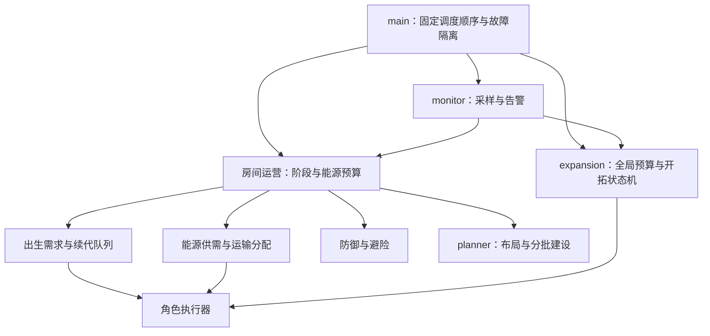

# Frontier：CPU 20 的殖民地架构与扩张策略

研究日期：2026-09-24。对象：AdamZmy / 官方 shard1 / W21N26 / Origin `(21,28)`；任务提供的初始状态为 GCL 7、CPU 20、RCL 1。本文的初审基线是 `main.js` `2026-09-24.2`、`planner.js` 版本 2 和 `expansion.js`，研究依据包括本地静态阅读、官方文档与原始 GitHub 源码。研究代理没有操作游戏或部署；后续由主代理完成的整合与部署状态见下文。

**Current implementation note (2026-09-25):** Six API-deployed modules include a static execution-plan archive (`plans.js`). Semantic strategy and complete surveys are retained locally; cold-room Memory holds candidate summaries after exact archive verification. Active room layouts restore on demand without Codex online. Main .6 adds bounded CPU attribution and movement-cache corrections. The energy dashboard uses total utilization including necessary operating costs. Current code and LIVE_STATUS.md supersede historical implementation statements below.

**推荐采用“全局约束 + 房间自治 + 专职执行”的混合架构。** 全局层管 CPU、外交与扩张预算；每个殖民地管自己的能源、生产、建设和防御；creep 执行具有目标和有效期的短任务。当前先让 W21N26 稳定，再建立一个能自主续代的辅房。并发开拓上限 1，总房间保护上限暂为 3，GCL 7 只作为可占领数量的资格。

**整合状态：主代理已部署 `main.js` `2026-09-25.2`、`planner.js` v3、`expansion.js` 与 `monitor.js`。** 以下状态来自主代理的集成和验证结果：

- **运行与经济已实现**：各模块独立加载，必要模块的异常分别隔离；单矿位分流、容器迁移、避免仓库搬运循环、低储备时实际升级吞吐节流，以及单矿位按回本条件提前更换体型。`.5` 增加跨 tick 补能目标和自采矿位预约；升级工达到半仓且足够约 10 tick 工作能量即可出发，避免为装满而持续改道。完整物流资源数量预留仍未实现。
- **监控已实现**：每 20 tick 统计 CPU EMA、升级进度、矿工覆盖、储备与限频告警。这里只确认采样能力，不宣称长期 CPU 或能源目标已经达到。
- **扩张已实现**：100 tick 储备非下降、CPU EMA ≤12、母房关键岗位稳定门槛；新增 `stabilizing`、新房自给检查和完成后 1,000 tick 扩张间隔。当前代码的 storage 启动门槛是 **12,000**；下文 **30,000** 是更保守的设计建议，尚未采用。并发开拓上限 1，总房间保护上限 3。
- **规划已实现并测试**：全 RCL 连通与配额检查、旧建筑复用、失败后 500 tick 重试；主代理记录的规划输出共 339 项、PathFinder 调用 6 次。该测试结果不等于所有在线施工已完成，也不代表防线封闭已经验证。
- **仍属后续改进**：运输目前是早期阶段 6 CARRY、常规阶段 12 CARRY 的门槛；按实测线路配置运力、按岗位期限排出生队列、物流资源预留、规划分片和防线封闭验证尚未实现。

**HTTP API 整合状态（2026-09-25）**：用户已明确要求，后续 Screeps World 的游戏数据读取、诊断和操作统一通过 HTTP API；不再使用 computer use、游戏界面或客户端 Console 作为读取、操作或验收渠道。主代理唯一负责 API 采样、认证凭据管理、版本整合与部署，其他开发代理读取主代理保存的脱敏工件。

主代理已使用新 Token 成功通过 HTTP 验证账号 AdamZmy 与 shard1，并确认远端四模块与本地内容完全匹配；本轮 API 迁移没有修改游戏策略代码。通过 HTTP 提交的 Console 诊断已被接受，尚待回读 `frontier.apiSnapshot` 并确认游戏 tick 更新；请求 accepted 不等于表达式已经成功执行，也不证明新的升级或扩张结果。

本地 CLI `screeps_api.py` 提供 `identity`、`status`、`memory`、`code-check` 与 `console --file`。`deploy` 的 dry-run 与 `--apply` 接口仍在实现和验收中，本记录不把它们当作已经可用的部署能力。Token 存在项目外权限为 0600 的文件，由主代理使用；不写入源码、游戏 Memory、日志、命令行参数、快照或代理交接材料，也不输出任何凭据。

监控默认依据主代理保存的 `state/api-frontier.json` 和 `apiSnapshot` 工件；每份证据必须标注 `fetchedAt` 与对应游戏 tick，内层遥测更旧时同时注明采样 tick。历史工件是缓存，不能当作当前实时状态。发现需要新数据时由主代理统一补采，子代理不独立重复请求 API，以避免重复负载与限流。API 不可用时准确报告读取失败，不回退界面操作。

**阅读约定**：下文保留研究时的“初审风险”和“拟实施”文字作为设计与审阅记录；其中部署状态已由本节更新覆盖，不能将已修复问题继续理解为当前缺陷。其余门槛、指标和模块拆分属于设计建议。本文不声称在线 RCL 已提升、辅房已完成或扩张已成功；这些结果仍需后续游戏 tick 数据确认。

后续 `.6` 补充矿工入位时的工作单位让位，防止空载工人堵住唯一矿位；扩张模块在目标已有自有 spawn 后停止母房继续生产开拓工，交由目标房本地生产恢复。最新在线结果单独记录在 `LIVE_STATUS.md`。

`.7` 在主房实际升到 RCL 2 后修正早期过量生产升级工的问题：RCL 2 达到 550 容量且每源已就位矿工 4 WORK，RCL 3 达到 800 容量且每源 5 WORK 之前，稳定保留 2 WORK 升级，其余现有升级工临时建设 extension/container，施工空档帮助筹集矿工换体能源，达标后自动恢复。monitor 增加分类施工进度和已建 extension 数量。本轮不改变配送算法；远矿通道拥堵仍需观察。

`2026-09-25.1` 针对实际观察到的工人供给偏差，增加低库存请求、90%高水位关闭及按剩余可工作tick排序：运输者不再因升级工每tick消耗2能量而长期给它零碎补仓。施工每WORK耗能按BUILD_POWER计，包含临时施工升级工。仍未实现按笔资源预留、按运输线路计量运力或haul取货目标持久化；本次只修补工人供给选择。

`2026-09-25.2` 进一步落实道路和物流：经济干线从 RCL 2 开始、同时最多 3 个道路工地，既有 v3 布局坐标保持不变，以 `roadVersion=1` 迁移道路分类。运输目标按源侧总积压加权并跨 tick 保持，90% 载量即配送；目标堵塞采用有限冷却与后续需求回退。监控增加逐矿库存和积压持续时间、实际在位 WORK、道路覆盖、运输疲劳与真实移动停滞。仍未实现完整资源数量预留、按往返周期动态配置运力；净库存减少也不等于实际搬运吞吐。线上施工/库存结果见 `LIVE_STATUS.md`。

## 1. 游戏约束与战略优先级

未解锁 CPU 时，额度固定为 20；GCL 增长不会自行提高这个额度。CPU bucket 是波动缓冲，最大 10,000，不能把持续超支变成可持续运营。运行时以 `Game.cpu.limit`、`tickLimit` 和 `bucket` 的实值决定预算。[官方 CPU 说明](https://docs.screeps.com/cpu-limit.html)

GCL 决定最多能控制多少房间；RCL 决定各房能建设什么。RCL 3 首次开放塔，RCL 4 开放 storage，RCL 5 开放 links。因而前期顺序是：出生恢复 → 采运闭环 → 五个 extension → 塔与补能 → storage 与储备 → 辅房。不要为了预留七个殖民地提前生产开拓队伍。[官方 Control](https://docs.screeps.com/control.html)

一个正常自有房 source 的持续产能上限是 `3000 / 300 = 10 energy/tick`，需要 5 个未强化 WORK 才能完整覆盖；两个 source 合计理论上限 20。实际可支配能源必须扣除 creep 续代、塔、修理与建设。每个 CARRY 容量 50，每个身体部件出生需 3 tick；普通 creep 寿命 1,500 tick，含 CLAIM 的为 600 tick。这些是容量估算的常量，不是当前房间已达到的实测表现。[官方常量](https://docs.screeps.com/api/#Constants)

## 2. 已核实的公开架构对照

| 方案 | 源码中实际采用的组织方式 | 本项目借鉴 | CPU 20 下的取舍 |
| --- | --- | --- | --- |
| 当前 Frontier | `spawnRoom` 集中决定出生；`mine/haul/work` 每个 creep 自行找目标；`planner/expansion` 独立模块 | 保留小模块和可直接读懂的角色逻辑，便于新局排错 | 局部自主寻路容易争抢资源；固定人数/部件数无法表达真实吞吐 |
| Overmind | Colony 聚合母房、外矿与资源网络；Overlord 管一个工作领域、提出 creep 需求；集中孵化器接收请求，执行层做任务 | 每个 source、物流、开拓行动有明确需求和责任；出生请求与行为执行分开 | 借鉴接口，不整体引入对象包装、复杂匹配、强化与跨殖民地网络 |
| The International | 全局 collective 配合按房间运行的 RoomServices/RoomOps；设计文档偏向数据与处理函数分离；需求包含运输和出生 | 每 tick 统一索引房间/角色；用运输距离和预计收入算 CARRY；按房间统计 CPU | 采用轻量数据对象与函数，避免复制整个框架；实际源码仍保留 Manager，不能把文档理想当作完全重写后的事实 |

Overmind 的 Colony 是一个母房及其外矿的管理单元，Overlord 向 hatchery / spawn group 提交有优先级的出生请求，并在寿命过滤中计入出生和行程时间。它是分层管理，而非每个 creep 完全自治。[Colony 源码](https://github.com/bencbartlett/Overmind/blob/5eca49a0d988a1f810a11b9c73d4d8961efca889/src/Colony.ts)、[Overlord 源码](https://github.com/bencbartlett/Overmind/blob/5eca49a0d988a1f810a11b9c73d4d8961efca889/src/overlords/Overlord.ts)

Overmind 的物流网络提供输入/输出请求，并采用稳定匹配分配运输者。本项目先实现“优先级 + 距离 + 本 tick 资源预留”，不需要立刻引入完整匹配算法。[LogisticsNetwork 源码](https://github.com/bencbartlett/Overmind/blob/5eca49a0d988a1f810a11b9c73d4d8961efca889/src/logistics/LogisticsNetwork.ts)

The International 的 `HaulerNeedOps` 根据 source 路径与预计收入累计运输部件需求，还考虑 controller 和其他负载；`RoomServices` 独立运行房间并测量 CPU。这比固定 12 CARRY 更适合地形差异。[运输需求源码](https://github.com/The-International-Screeps-Bot/The-International-Open-Source/blob/7e5106eebffb9627cf08cf893b6846012d970b90/src/room/commune/haulerNeedOps.ts)、[房间调度源码](https://github.com/The-International-Screeps-Bot/The-International-Open-Source/blob/7e5106eebffb9627cf08cf893b6846012d970b90/src/room/roomServices.ts)、[设计文档](https://github.com/The-International-Screeps-Bot/The-International-Open-Source/blob/7e5106eebffb9627cf08cf893b6846012d970b90/DESIGN.md)

核实的是 Overmind `master` 的 `5eca49a`（2019-06-14）与 The International `Main` 的 `7e5106e`（2024-08-27）。这些历史提交用于研究架构，不据此宣称其当前兼容性、维护活跃度或 CPU 性能；不能直接上传替换正在运行的新局。

## 3. 模块边界与数据契约



以下是逻辑边界；前期不必把每项拆成独立文件。`main.js` 先以小函数保持这些接口，只有职责和验证稳定后再拆文件。

| 模块 | 独占职责与输出 | 不应承担的职责 |
| --- | --- | --- |
| `main` 调度 | 建立本 tick 索引；先运行防御、续代和 creep 生存动作；分别隔离模块异常；记录错误 | 不直接嵌入候选房评分、布局搜索 |
| 房间运营 | 输出 `phase`、`energyMode`、出生/建设/升级预算；判断恢复模式与自给状态 | 不替其他房间抢占全部预算 |
| 出生调度 | 接受各模块请求；按优先级、截止 tick、缺口排序；记录等待原因和结果 | 不在角色执行函数中直接生产 creep |
| 采矿与物流 | source 分配、有效 WORK、实际产出、运输周期、供需目标预留 | 不让多个 hauler 各自承诺同一笔库存 |
| `planner` | 稳定锚点、分阶段布局、合法性/连通性校验、受预算约束的施工请求 | 不决定宏观扩张，不阻断防御与出生 |
| 防御 | 威胁强度、撤退目标、塔协同、safe mode 条件；提出防卫与补能需求 | 不把“没有可见攻击者”当作长期安全证明 |
| `expansion` | 侦察、候选比较、开拓队预算、任务状态、母房支援和移交验收 | 不以“spawn 出现”直接认定新房成熟 |
| `monitor` | 分阶段 CPU、能源趋势、角色/源覆盖、队列延迟、行动结果；限频异常事件 | 不保存无限日志，不每 tick 全量持久化对象 |

建议请求结构：

```js
// 出生需求；数值阈值由房间运营层提供
{ id, home, operationId, role, body, priority, neededBy, target, minEnergy, expires }

// 物流需求；reservedAmount 为本 tick 临时预留
{ id, room, sourceId, targetId, resource, amount, reservedAmount, priority, expires }

// 可跨 tick 的开拓行动；只保存简单数据
{ id, home, target, state, started, lastProgress, budget, reason, stableSince }
```

每个 creep 每 tick 只能由一个执行器决定动作；`home` 是归属，`operationId` 是临时任务，`room.name` 是当前位置，三者不要混用。持久化对象 ID、坐标、状态和统计摘要；房间对象、creep 对象、CostMatrix 和当 tick 预留表放在可重建缓存。`Game` 每 tick 重建，`Memory` 是 JSON，不能保存有效的游戏对象引用。[官方全局对象与 Memory](https://docs.screeps.com/global-objects.html)

## 4. CPU 20 的调度与监控

以下阈值是保守起点，需要实际 500–1,000 tick 数据校准；不是某个开源项目的性能承诺。

| 任务 | 运行频率 | 约束 |
| --- | --- | --- |
| 塔/避险、经济 creep 动作、紧急续代 | 每 tick | 最早运行；单房异常不阻断其他房；核心仍超支时关闭可选任务 |
| 房间对象与角色索引 | 每 tick 一次 | 后续模块共用结果，避免循环里重复全局过滤 |
| 生产需求、基础建设队列 | 需求变化时；兜底每 5–10 tick | 应急缺矿工/运输者即时触发 |
| 监控摘要 | 每 20 tick | CPU、bucket、能源、角色、出生等待与吞吐趋势；告警去重 |
| 候选评分、战略调整 | 每 50–100 tick | 各房错开；不能只看单次 CPU 低值 |
| 完整布局、复杂路线和防线优化 | 空闲时分片推进 | `bucket > 7000`、本 tick 尚有预算；保存进度，预算到即让出 |

运行稳态目标：整体 CPU EMA 低于 12，p95 尽量低于 16，bucket 保持回升或稳定。EMA 已上线也不等于 p95 已实现；没有分位数时至少记录最近窗口最大值及高耗 tick 次数。两房成熟前暂不运行跨 shard、市场搜索、化合物优化或像素生成。

建议降级：bucket 低于 5,000 暂停新扩张与完整规划；低于 2,000 停止侦察补充及非必要视觉；只保留生产恢复、能源物流、防御与防降级。阈值恢复应有滞后，例如 bucket 回到 7,000 且 CPU 稳定后才重启战略工作，避免每 tick 反复切换。

必须观察的指标：

| 指标 | 计算/含义 | 初期使用方式 |
| --- | --- | --- |
| source 利用率 | 一个再生周期内实际采出 / 可再生量 | 优先达到每源 90%；`WORK >= 5` 仅是能力上限，不能替代实测 |
| 运输覆盖 | `可用运输容量 / 实测往返周期` 与需要搬运的 energy/tick 比较 | 先覆盖源到核心，再给升级和建设增加额度 |
| 净储备趋势 | storage、container、可用核心能量的窗口增量，排除内部转移 | 判定是否有可持续扩张/升级余量；只看 storage 会误判资金搬家 |
| 出生饥饿 | 有有效需求但因缺能无法生产的 tick 比例 | 稳态目标小于 5%；过高则减升级、补填充 |
| 续代余量 | `TTL - 出生时间 - 行程 - 队列等待 - 缓冲` | 关键岗位小于 0 必须提前补；常量 `body.length*3+35` 不能覆盖所有位置 |
| 升级吞吐 | 同 RCL 的 controller progress 增量 / tick | 升 RCL 时重置窗口；不要把旧级进度相减 |
| 停滞与动作失败 | 连续未移动、`ERR_NO_PATH`、施工错误、出生失败 | 按目标和原因聚合，避免日志刷屏 |
| 规划健康 | 每阶段合法建筑数量、可达性、防线封闭、施工失败点 | 缺 10 labs 不应自动否决可用的 RCL 4 辅房布局 |

运输需求建议按 `ceil(q * T / 50)` 估算 CARRY，`q` 为该线路 energy/tick，`T` 为满载、空载、装卸和拥堵的整个周期，再加约 20% 余量。例如两个源都需搬 10 energy/tick，单程 20 tick、装卸合计 2 tick，每条线路约需 9 CARRY，合计 18；固定 12 只能提供约 `600/42 = 14.3 energy/tick`。这只是说明固定配额风险的算例，不是 W21N26 的实测路程。

## 5. 成长与扩张门槛

| 阶段 | 工作目标 | 离开该阶段的条件 |
| --- | --- | --- |
| RCL 1–2，bootstrap | 至少一个能采能送的恢复角色；逐步建立专职矿工与 hauler；扩容优先 | 源与出生区之间形成闭环；工人死亡后能自己补回；五个 extension 逐步完成 |
| RCL 3，stable economy | 塔和补能链路；减少小体型 creep 数；道路只修高利用率干线 | 关键岗位完成至少一次续代；运输不堆积；没有持续出生饥饿 |
| RCL 4–5，prepare expansion | storage 储备、按实际盈余调节 upgrader；一名 scout 建立邻房与沿途情报 | 满足下方母房、目标、队伍和 CPU 四类门槛 |
| 开拓进行中 | 仅一个目标；维持 controller、建设首 spawn、支援续代 | 到达 `stabilizing`，并完成自主运营验收 |
| 辅房稳定后 | 两房共同运行与观察；第三房需重新评估总负载 | 辅房 complete 后至少再观察 1,000 tick；所有门槛重新满足 |

建议门槛应组合判断，不能任一通过就扩张：

1. **母房**：至少 RCL 4 且有 storage 和可持续补能的塔；核心矿工、运输者无接替缺口；储备趋势覆盖至少 100 tick、最好 500 tick 为非负；先预留 10,000–15,000 应急储备，再计算开拓预算。实践上可从 storage 30,000 的保守启动点开始，最终数值以新实现和测量为准。
2. **CPU**：bucket 至少 7,000，CPU EMA 低于 12；把现有 creep 与预计新增 creep、规划、寻路的成本合算，不能只因为当前某个 tick 很便宜就放行。
3. **目标和路线**：首次优先一房距离，两个可达 source、可建首 spawn 与 RCL 4 核心；目标及沿途情报在出发前刷新；无他人占领/预留、明确敌对威胁或不可达出口。远距离候选可以记录，优先级低于最近可支持房间。
4. **生产与队伍**：未来一个运输/抵达窗口内，母房紧急替补能先出生；claimer 与 pioneer 按实际旅行时间计算可用寿命；开拓预算包含首次队伍、至少一轮补员及必要的能源运输。当前 1 claimer + 2 pioneer 的体型费用合计 1,750，仅是首批身体费用。
5. **完成验收**：首 spawn 已成、目标有采矿与补能链路、升级不断档、能从本房生产接班 creep，并持续稳定至少一个短观察窗口；外援撤掉后仍可运行。早期可先用有效矿工/运输/施工角色覆盖和本地出生记录作近似，再迭代到真实吞吐。

建议开拓状态机：`candidate → scouting → approved → claiming → bootstrapping → stabilizing → complete`；并列异常状态 `paused / blocked / aborting`。`approved` 是内部规则通过，不表示每次都要求用户确认。每个状态有 `lastProgress`、失败原因与下一次检查时间；CPU 或储备不足进入 paused，目标被占、路线长期不通进入 blocked。不要把所有暂时困难都永久阻塞全局扩张。

`bootstrapping` 阶段明确策略：RCL 1 只投入足够能量到 RCL 2，随后优先首 spawn、维持 controller、确保源可采；根据路程和开拓者工时选择“当地自采”或“母房运输支援”。首 spawn 的施工成本为 15,000；母房持有 12,000 energy 并不等于这些能量会自动到达新房。[官方施工常量](https://docs.screeps.com/api/#Constants)

当前总房间保护上限继续保留 3，但这是上限而非到点自动凑满的目标。CPU 20 下先验证一主一辅；后续向更远处扩张时，把成熟辅房作为新的支援中心，减少母房的跨房行程。外矿与直接占房应比较净能量、出生占用、CPU 和防卫成本，不为“地图更大”单独增加房间。

## 6. 初审代码中最关键的风险

| 优先级 | 初审证据与触发条件 | 影响 | 应对与同轮状态 |
| --- | --- | --- | --- |
| P0 | `main.loop` 把 `planner.run → defend → links → spawnRoom` 放在同一个房间 try 内；`planner.ensure` 同步生成完整布局 | 规划异常跳过该房防御与出生；规划 CPU 耗尽可使后续全部任务丢失 | 主代理已安排先执行必要模块并隔离 try；完整规划还需预算与分片 |
| P1 | `spawnRoom` 固定运输 12 CARRY、升级 10/16 WORK；初审 `stored` 总库存变量没有用于预算 | 地形较长时运不动；仓储不足时升级仍吸收大量能源，延迟恢复与建设 | 同轮已安排实际升级吞吐节流、economy mode；后续按运输周期和净收入定配额 |
| P1 | `expansion.tick` 原门槛为 RCL 4、storage 12,000、bucket 7,000，外加 20 tick 前抽样 CPU ≤12 | 库存可能暂存但不增长；无法识别替补潮与运输缺口 | 主代理正增加 CPU EMA、储备趋势、母房岗位稳定门槛；仍需真实窗口验收 |
| P1 | `expansion.tick` 看到新 spawn 直接 complete；pioneer 变 bootstrap 后立即归属新房 | 新房尚未实现自主续代就可能开启下一目标 | 同轮拟加入 stabilizing、自给检查、complete 后 1,000 tick 间隔 |
| P1 | `planner.makePlan` 一次规划至 RCL 8；`expansion.record` 可为侦察到的无主房调用 ensure；complete 仅检查 60 extension、10 lab、3 spawn 数量 | CPU/Memory 增长；数量齐全不代表可达与防线有效，缺 labs 又会否决经济可用房 | 候选先做轻量 RCL 4 检查；仅前几名跑全规划；增加阶段与连通性验证 |
| P1 | `alive()` 只加固定 35 tick 行程余量；spawn 使用单一 if/else 且不保存需求期限 | 同龄关键 creep 连续老死时，队列等待使接班来不及 | 按岗位路程与预计出生队列算 deadline；保留最小恢复体型 |
| P2 | `haul/refuel` 各自选择库存/目标，没有本 tick 预留；多次 `find`、全局 creep 过滤和 `findClosestByPath` | 重复抢同一能量、小量绕行、CPU 随 creep 数扩大 | 共用房间快照；先实现贪心预留，再评估是否需要更复杂匹配 |
| P2 | `travel` 每 tick 重算房间路线，再按直线距离选出口；未确认出口可达 | 路径重算成本和特定出口卡死；`unreachable` 没有完整行动恢复机制 | 缓存房间路线与有效出口；局部无路后选别的出口；统计卡死 |
| P2 | `planner.build` 忽略非 OK 的施工结果；方形 perimeter 与 `complete` 没有封闭性/覆盖测试 | 计划“完整”但关键工地无法落下，建筑可能落在围墙外 | 按错误码记录冲突点；按 RCL 验证连通，防线用 flood/min-cut 类方法离线或分片检查 |
| P2 | 模块 require 的 catch 静默；初审没有持续关键错误计数 | 模块没加载却继续运行，缺失策略不易被发现 | 启动与版本变化时明确报告加载失败；限频日志和健康状态 |

本轮研究没有把静态风险当成已发生事故。布局可达、经济吞吐与 CPU 超限都需要实测；尤其当前没有 W21N26 源位置和完整 tick 序列，因此不会虚构最优锚点、真实收入或必然扩张时间。

## 7. 开发代理分工与交付顺序

开发代理按需承担有限任务，与游戏内管理模块分开。游戏每 tick 仍由同一个确定性 JavaScript 主循环调度。每次委派先确定具体范围、文件所有权、输入工件和完成条件；任务完成即交回结果并释放文件，不要求代理常驻或依赖无限延长的上下文。

| 开发职责 | 文件/接口归属 | 验收产物 |
| --- | --- | --- |
| 主代理：API 采样与集成 | 唯一 API 请求与凭据管理者、整合部署者；维护采样工件、版本与发布清单；收回文件所有权后合并修改 | 通过 HTTP 核验账号、分支和四模块源码；诊断需回读新 tick；保留修改前后证据与回退版本 |
| 监控代理 | 默认只读 `state/api-frontier.json`、`apiSnapshot` 及主代理指定的其他脱敏工件；默认不取得 `monitor.js` 修改权 | 标注 `fetchedAt`、游戏 tick、必要的内层采样 tick；区分事实、趋势与未知；给出带证据的异常报告与补采需求 |
| 能源代理 | `main.js` 与对应经济测试；每次约定具体函数范围 | 恢复生产、运输覆盖、源利用率与储备变化的行为验证；释放文件供主代理整合，不读取凭据或自行部署 |
| 布局代理 | `planner.js` 与对应布局测试 | RCL 分阶段有效布局、道路与工地行为、配额及通路验证；不把离线检查写成在线 CPU 或施工结果 |
| 战略/审阅代理 | 默认只读指定代码与脱敏工件；仅明确委派时编辑 `ARCHITECTURE.md` 等指定文档 | 来源核实、策略门槛与具体风险报告；不修改其他代理持有的文件，不读取凭据或请求游戏 API |

同一文件不安排重叠写入；需要主代理整合时，原负责人先交付并释放所有权。上述职责是可选择的任务类型，不表示全部同时启动。`monitor.js`、API CLI 或其他文件的修改必须另行明确归属，不能从“监控代理”名称推定修改权。各代理需要补采时向主代理汇总问题，由主代理一次性采样并分发工件，不重复抓取，不传播认证凭据。

每个交付包含行为变化、输入工件及其时效、验证证据、CPU/能源影响与未验证项。API 回应、诊断执行和游戏效果分开验收：`code-check` 证明源码一致，Console 请求被接受仅证明进入队列，更新的 `apiSnapshot` tick 才能确认诊断回读；经济收益仍需后续 tick 数据。新增功能以具体场景验证，不再要求打开游戏界面校验。长期信息落在版本化文档、有限历史和脱敏快照中，下一次任务从这些工件恢复工作。

推荐落实顺序：

1. **当前新局**：先完成异常隔离、恢复生产、能源预算与 monitor，观察至少一个 source 再生周期；缺人和错误立即处理。
2. **RCL 2–3**：按道路/地形测运输周期；降低无效 creep 和重复查找；以一次完整关键岗位续代证明经济稳定。
3. **RCL 4 前**：完善开拓状态机与母房/辅房验收；为最近候选做轻量规划；通过模拟错误和无路输入检查恢复路径。
4. **首次辅房**：一处开拓，持续记录支援成本和自主出生；稳定后再决定第三房或外矿。

研究仅写入本文，不修改 Arena 源码、地图编辑器数据或系统结构图；当前 Screeps World 项目是独立目录。

## 8. 2026-09-25.3 能源闭环

ledger.js逐tick读取上一tick事件，按真实产出与实际用能计量；monitor每20tick汇总供给、费用、成长和有界历史。main每100tick更新运输与建设/升级需求，运输下调延迟300tick；矿工提前接班，库存模式设滞后。指标有预热、归因和库存约束，不把花光储备当作持续改善。

只读Vercel网页由服务端API输出脱敏遥测，密钥仅放敏感生产环境变量。游戏写入仍由root本机API管理，20分钟heartbeat承担持续检查与需要代码修改的诊断修复。详细字段、边界、阈值和验收见ENERGY_METRICS.md。
