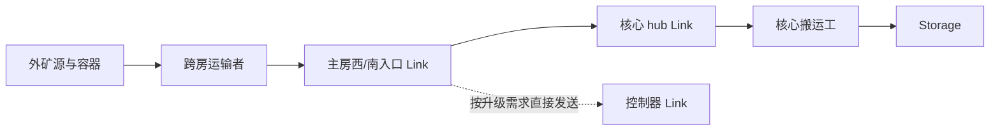

# W21N26 布局、外矿与入口 Link：研究结论

2026-09-25。本文首先记录研究阶段（当时游戏为 `.8`）的发现。后续用户授权立即实施，已于游戏 `.9`、tick73930296激活复核规划，并同步原监控网站。具体复用方法、限制及205项新布局见 [实施说明](layout-implementation/README.md)；上线证据以项目 LIVE_STATUS.md 为准。下文“下一阶段”保留为当时验收要求，已经落实的项目见实施说明。

## 结论

采用公开的自动规划算法作为下一阶段离线候选生成基础，保留现有设施，比较候选的真实物流和防御表现。现有“按几何距离放建筑、固定方框防线、默认铺向出口、凑满 Link 数量”的自写布局不能继续作为合格基线。

- **完整候选生成优先研究 The International 的分块自动规划器**。它把布局、道路、升级位和最小割防线联合处理；需要适配现有建筑约束并核验源码边界。不是整包上传该机器人的运行系统。
- **可先直接复用 Overmind / International 的 min-cut 子算法**。两份原始实现已经离线跑通真实地形。防线结果仍须检验核心交通是否保持在同一个受保护区域，不能只验“敌人摸不到建筑格”。
- **Overmind 的整张 bunker 模板不适合本房原位套用**。精确模板在保持现有 Spawn 的 24 种旋转、镜像和 Spawn 槽位组合中都与地形冲突；这不否定它的道路、防线和物流设计。
- **入口 Link 使用已有实践**：外矿 hauler 跨入主房，向入口 Link 卸载，再传到 hub。公开 LiveScreep 源码已有这条链路。主房西、南两入口应按实际外矿分工研究，不能任意补满第 5、6 座。

详细源码比较、提交及许可见 [planner-research.md](planner-research.md)；外矿链路与收益模型见 [remote-link-strategy.md](remote-link-strategy.md)。

## 原布局参考了什么，哪些问题已坐实

此前 ARCHITECTURE.md 引用 Overmind 与 The International 的 colony、任务、运输和出生架构；并未直接采用它们的布局生成器。当前 planner v3 的建筑选址按 Chebyshev 距离排序，防线为 Spawn 周围固定方框。这一来源边界必须说清，不能称为成熟公开布局。

本房审计基于 API 快照 tick73929558，2026-09-25 06:21:06 UTC。它验证的是终局计划几何，不表示未来建筑已经建成。

| 检查 | 结果 | 含义 |
| --- | --- | --- |
| RCL 配额及可达性 | 原有检查通过 | 不能据此证明物流、防线和施工顺序合理 |
| 北山后 5 个 Extension | `(22,21)、(24,21)、(21,20)、(23,20)、(25,20)`；补能单程23–24格 | 几何距离仅5–6格，绕山来自选址算法；不是寻路缓存可以修掉的问题 |
| 防区内运输 | 上述5个 Extension 与 Link `(20,19)` 的补给必须穿过防区外 | 建筑格自身不直接暴露，却属于不同的封闭口袋；必须检查己方受保护交通连通 |
| 本房60个 Extension 服务距离 | 从 Spawn/Storage 的可行走邻格计算，均值6.517、p95=23、最长24格 | 下一阶段应比较整个分布，不用平均数掩盖最差路径 |
| 出口延伸道路 | 34/168格只服务出口；同时移除不增加本地服务道路最短距离 | 未来外矿可能需要其中某条，但要绑定实际源、跨境点和交通量，而非默认全部建设 |
| 两个额外 Link | `(12,19)、(20,19)`；距旧 Storage 服务范围8/22格 | 代码为凑6个配额而放置；generic hauler仍会给它们填能并发往controller，不能说完全闲置，但这不证明有净收益 |
| 墙外资源设施 | 南源container/link、矿物container/extractor | 资源位置固定，外置并非自动错误；要另算安全、维护和通路 |

证据与可复用检查：[layout-audit-before.json](../state/layout-audit-before.json)、[audit-layout.cjs](../tools/audit-layout.cjs)。默认验收已拒绝依赖防区外交通的6个核心目标。

## 公开布局经验如何转成约束

1. **密度要与补能路线一起设计。** 原作者论坛讨论明确区分“都塞进一个小方块”与“所有 Extension 能从内部补给”；孵化出口、运输拥堵、Storage/Terminal/Lab 邻接也要一同考虑。[Room blueprint feedback](https://screeps.com/forum/topic/2436/room-blueprint-feedback)
2. **理论填满一整圈不是日常唯一负载。** 玩家关于 Extension 数组的讨论提醒，设施耗能频率不相同，实际补给受零散孵化需求影响；应比较循环路径与实际需求，不能只优化一张漂亮的静态图。该老帖含修改过的身体假设，数值不直接套用。[Compact Extension Arrays](https://screeps.com/forum/topic/136/compact-extension-arrays/3)
3. **重计算应一次进行，执行只读结果。** 玩家报告采用模板定位一次、缓存，再低频创建工地。这里进一步在 Codex 本地计算和检验，以免把高成本布局搜索放回逐tick逻辑。[Automatically placing construction sites](https://screeps.com/forum/topic/2349/automatically-placing-construction-sites)
4. **确定路线后保留顺序。** 论坛对反复 findClosestByPath 的讨论指出，相同路径重复求解和目标访问顺序会互相影响；布局应给稳定的补给路线提供条件。[Extensions/spawns refill order](https://screeps.com/forum/topic/2426/how-can-i-store-all-my-extensions-spawns-in-order)

这些是原作者经验，不代表某种模板在本房自动最优。下一阶段用相同的地形、既有建筑与运输需求对比。

## 已运行的公开算法实验

- **Overmind 原始 bunker**：解析其实际RCL8模板，保持已建Spawn `(21,28)`，允许对应模板3个Spawn槽和8种朝向，共24组合，地形兼容0。全房自由选位有352个朝向/位置组合，但需要迁移现有设施，不能当作无损方案。[实验脚本](check-bunker-fit.cjs)、[结果](bunker-fit.json)
- **International / Overmind 原始 min-cut**：对12个现有核心建筑及保护区分别求割，得到27/25个防线格；对含道路、容器的36个已建对象求割，得到36/34格。四组实验均无被出口洪泛触及的保护目标，且受保护地形为单连通区域。两算法的保护输入语义不同，不能按数量简单判优。该实验只检验子算法，不是新的完整RCL8布局，也未验战斗强度。[结果](mincut-demo/result.json)

研究中已看到原始 planner 的边界问题，例如 International 的 source-link 索引0判断、矿路评分使用数组数量而非总长度，以及规划对既有建筑约束的不足。复用源码同样必须测试，知名项目名称不替代验证。

## 周边基地与外矿的初步分工

最新情报工件 fetchedAt06:40Z、status tick73929840。不同房间的 `seen` 不同，缺 reservation 字段；以下为候选分工，不是已确认可安全占领的命令。

| 房间 | 与主房通路 | 建议先研究的用途 |
| --- | --- | --- |
| **W22N26** | 西邻，直连，双矿 | 第一优先重新评估第二基地；也可在明确阶段内暂作近外矿。旧算法的 `extension-25 unreachable` 不应成为否定它的证据 |
| **W21N25** | 南邻，直连，单矿，四出口 | 近外矿及南/东走廊；若运输周期更短，也可能先于双矿房启动 |
| W23N26 | 经W22N26，两跳，双矿 | 西向基地备选或未来W22N26的外矿；不能仅因旧评分高就优先跨过去 |
| W21N24 | 经W21N25，两跳，双矿 | 南向基地备选；旧布局一源路长34格，需要重定位核心 |
| W21N27 | 需绕W22N26/W22N27，三跳 | 后置；房名相邻不等于有北出口，且已记录沼泽较多 |

需要比较基地将来的外矿覆盖，而非逐房只数两颗能源源。一旦W22N26成为基地，它的能量优先供自身建设/升级，不能同时计作主房永久外矿收入。

## 入口 Link 预留与取舍

已有公开实现：[LiveScreep remoteHauler](https://github.com/LuckyKoala/LiveScreep/blob/0f033630bd0b1927f5a017be9182e842cce4011d/src/role/remoteHauler.js)、[putToLink](https://github.com/LuckyKoala/LiveScreep/blob/0f033630bd0b1927f5a017be9182e842cce4011d/src/action/putToLink.js)、[link service](https://github.com/LuckyKoala/LiveScreep/blob/0f033630bd0b1927f5a017be9182e842cce4011d/src/service/link.js)。

RCL8的 `hub + controller + 2个本地源 + 西入口 + 南入口` 共6座，只是可选的完整组合；近源离核心很近时，可以把其配额留给更有收益的用途。RCL5仅有2座，先比较hub配远源、入口或controller的收益，不能固定把两个配额都抢占。

在完整道路、稳定满载、1MOVE:2CARRY的理想模型中，单程省d格、流量q时，少出生运输身体的摊销约为`0.002dq` energy/tick；一次Link损耗约`0.03q`。仅这两项约在 **d=15格**打平，还没扣接收工、施工、防守和等待费用。800容量也不是无限吞吐，发送冷却随Link间距离增长，多个外矿汇流要验证能否及时卸空。数学近似不是已测收益。[官方Link规则](https://docs.screeps.com/api/#StructureLink)

入口精确坐标仍待完整跨房路径比较；应落在可防守且有卸货/让行空间的位置，不机械贴边。现有hub与Storage唯一共同邻格 `(20,27)` 恰是经济干道的roadCore，固定接收工会占交通节点，这也要纳入新布局。

## 下一阶段验收

- 固定当前Spawn、10个Extension、塔、容器与经济道路，明确哪些对象必须保留，拒绝自动拆除流程。
- 从公开planner离线生成多个候选，分别比较RCL1–8阶段、总建造量、核心服务距离分布、矿/控制器路径、实验室反应范围和出生出口。
- 全部核心建筑的服务位应处于连通的受保护交通区；再独立验出口封闭、门口通行、塔覆盖与防守空间。
- 每段远行道路绑定具体源、跨境格、外矿归属或防守用途；未启动的出口保留通行可能即可。
- 每座Link有生产者、消费者、吞吐、损耗和回退路线；给运输者卸货位和接收工站位，不能只标一个建筑坐标。
- 通过相同审计后，才将选定坐标放入轻量执行计划，并同步网页。复杂研究与搜索过程保持在本地。
