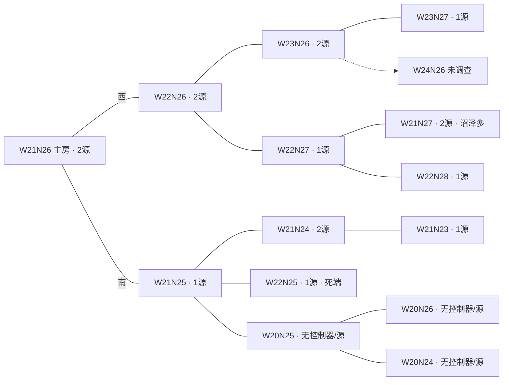

# 外矿、第二基地与入口 Link：只读研究

研究日期：2026-09-25。未修改游戏模块、Memory、建筑或部署。

结论：优先用改进后的布局算法重新评估紧邻双矿房 **W22N26**；近期外矿先比较 W22N26 与 W21N25 的实际运输周期。主房入口 Link 先预留**西、南两个方向**，不要现在落具体坐标。它能缩短外矿运输者在主房的行程，但必须同时满足 RCL 配额、真实流量、接收端卸空和防守条件。主房目前 RCL3，应先规划，不能实施 Link。

## 证据范围

- [expansion-research-input.json](../state/expansion-research-input.json)：API 工件 fetchedAt `2026-09-25T06:40:33.782868+00:00`，status tick `73929840`、版本 `.8`、主房 RCL3、storage=0、扩张为空。intel 的各房 `seen` 独立，范围 `73929248–73929851`；这些不是同一 tick 的同步世界快照。
- [layout-world-W21N26.json](../state/layout-world-W21N26.json)、[layout-plan-W21N26.json](../state/layout-plan-W21N26.json)：主房地形/建筑快照 tick `73929558`，布局 v3；用于核对已有规划，不冒充当前已建状态。该建筑快照未建 storage/Link。
- [expansion-plan-summaries.json](../state/expansion-plan-summaries.json)：root 补充导出的既有 v3 规划摘要。以下路线长均是**旧 anchor 的布局估计**，不是最优路径或实测运输周期。
- 未调用游戏 API、凭据、UI，也未额外调查其他玩家。intel 没导出 reservation 字段；缺 owner、hostiles=0 只说明该次记录未显示所有者/敌人，不能保证当前无人预留、无风险。

## 实际邻接与房间分工

主房只有西、南出口。图中实线取自真实 `intel.exits`；框内数字为已记录的能源源数量。

W21N27 在房名坐标上靠近主房，但没有主房北出口，已知路径要经过 W22N26、W22N27，共 **3 次跨房**。W22N25 与 W22N26 也不连通。不能把房名相邻当作可通行邻接。

| 房间 | 已知跨房数 | 适合先研究的角色 | 判断与限制 |
| --- | ---: | --- | --- |
| **W22N26** | 1，西入口 | 第一优先重评的第二基地；也可先作近外矿 | 双矿、直达、可向西和北继续展开。旧候选缺席的原因是 v3 `extension-25 unreachable`，不能据此否定房间。旧 source 路长 17/15，controller 4；需换算法重排、验证全部道路/建筑。 |
| **W21N25** | 1，南入口 | 近外矿与南/东走廊 | 单矿，但四出口，通向南部双矿和东侧无控制器走廊；实际路径短时可优先启动。通常先利用外矿价值，不为入口 Link 单独占用一个基地名额。 |
| **W23N26** | 2，经 W22N26 | 西向第二基地备选，或 W22N26 的下一阶段外矿 | 双矿、已记录步行地形中沼泽约1.7%；但母房支援须穿过 W22N26。旧 controller 路长24，是升级物流负担；不能因旧 score187 就越过邻接双矿。 |
| **W21N24** | 2，经 W21N25 | 南向第二基地备选 | 双矿、记录无沼泽、两出口；旧一源路长34、另一13、controller15。无沼泽不等于采运紧凑，需重新定位核心。 |
| W22N27 / W22N25 | 2 | 对应走廊基地的单矿外矿 | 前者是北向通道；后者唯一出口接 W21N25，战略延伸有限。是否盈利看完整路径和预留/护卫成本。 |
| W21N27 | 3 | 后置候选 | 双矿，但已记录可走地形中沼泽56.6%，主房不直达；筑路和支援成本未明确前不应提前。 |
| W20N25 / W20N26 / W20N24 | 2 / 3 / 3 | 交通与后续侦察走廊 | 已记录无 controller、无 source；不能算能源外矿或常规殖民房。 |

分工有两种合理路线，现有证据不足以强行定案：

1. **紧邻建第二基地**：W22N26 通过新规划后成为辅房，W23N26/W22N27 优先由它组织。主房南侧 W21N25 仍可作近外矿。此时主房西入口的长期输入可能下降，不能用“W22N26 永久外矿”流量为西 Link 算永久回报。
2. **保留紧邻外矿、基地向外展开**：W22N26 保持外矿，W23N26 成为西向基地；或选 W21N24 作为南向基地。跨房支援较长，却可能覆盖新外矿腹地。W22N26/W21N25 的每个矿源必须指定唯一供给基地，按完整路径分配，不能在两个基地收益里重复计算。

已知图中 W22N26、W21N25 分别承担主房西、南方向的首段通道。这是当前已调查子图上的关口，不表示未调查世界不存在绕路。下一轮应优先补齐 W24N26、W23N28、W20N27 等连接与实际路线，再评价外围基地的覆盖价值。

## 入口 Link 的实际链路

`外矿 source/container → 跨房 hauler → 主房入口 Link → 主房 hub Link → 核心搬运工 → storage`

入口 Link 接受 creep 卸货，**在 Link 网络里它是发送端**；hub 才是接收端。Link 只能在同一个房间内传能，不能隔房对传，不能直接把能量写入 storage。因而不能在未拥有的外矿建设 Link 后跨房传送，也不能靠它省掉外矿房内或中间房的行程。[官方 StructureLink API](https://docs.screeps.com/api/#StructureLink)

这不是仅有概念的用法：原作者 [LuckyKoala/LiveScreep README](https://github.com/LuckyKoala/LiveScreep/tree/0f033630bd0b1927f5a017be9182e842cce4011d) 明确描述出口附近供 remoteHauler 使用的 Link。固定 commit `0f033630bd0b1927f5a017be9182e842cce4011d` 的 [remoteHauler.js](https://github.com/LuckyKoala/LiveScreep/blob/0f033630bd0b1927f5a017be9182e842cce4011d/src/role/remoteHauler.js) 将 PutToLink 排在 Storage 前；[putToLink.js](https://github.com/LuckyKoala/LiveScreep/blob/0f033630bd0b1927f5a017be9182e842cce4011d/src/action/putToLink.js) 选择附近不足6格、未满的 source 类型 Link；[service/link.js](https://github.com/LuckyKoala/LiveScreep/blob/0f033630bd0b1927f5a017be9182e842cce4011d/src/service/link.js) 再将输入发往 center。可借鉴角色分工和卸货回退，不能照搬其旧 API、仅满仓才发包或逐项挑选目标的实现。

实施前置条件：主房至少 RCL5、两个可用配额、storage/接收搬运已有保证；外矿双向路径稳定、入口安全且不堵唯一道路；发送和接收的平均吞吐覆盖分配流量；Link 不可用或满仓时运输者能回退到 storage/其他接收点。先用一条已成熟外矿通道验证，再扩展第二入口。

## 冷却、容量与损耗

官方规则：每 Link 容量800，成本5000；RCL5/6/7/8 分别允许2/3/4/6座。发送端冷却按两 Link 的 Chebyshev 距离 `r=max(|dx|,|dy|)` 计算，每格1 tick。[官方 API](https://docs.screeps.com/api/#StructureLink)

官方 [engine 的 Link transfer](https://github.com/screeps/engine/blob/master/src/processor/intents/links/transfer.js) 进一步确认：实际发出 `b`，接收 `b-ceil(0.03b)`；目标剩余容量按扣损耗**前**的 b 裁切；冷却检查属于发送端。接收端处于发送冷却时仍能接收，但需有容量。协调器应预留每个目标本 tick 的容量，防止多个输入同时挤向同一空位。

理想持续输入上限是 `800/r` energy/tick，扣损耗后 `776/r`；实际还受卸空速度、补货间隙和调度空档限制：

| Link 距离 r | 输入上限 | 完整800包的净接收上限 |
| ---: | ---: | ---: |
| 20 | 40/t | 38.8/t |
| 30 | 26.67/t | 25.87/t |
| 40 | 20/t | 19.4/t |
| 45 | 17.78/t | 17.24/t |

普通未预留源理论平均5/t、预留源10/t；一间预留双矿房为20/t，四源为40/t。[官方常数](https://github.com/screeps/common/blob/master/lib/constants.js) 因而距离40的单入口 Link 承接双矿20/t已经没有调度余量；多间外矿汇总时不能只看800容量足够。优先重分配入口/接收目标或由近处新基地接管，不能默认一座边缘 Link 覆盖整条走廊。

800包损失24，10包损失1，碎包可能高于3%。把入口→hub→controller串成两次传输，理想保留率仅 `0.97²=94.09%`，还会叠加取整；需要升级能量时可按需求让输入 Link 直接发 controller，避免不必要的二次跳转。为了缩短冷却额外加中继，必须先证明吞吐瓶颈值得额外配额和损耗。

一辆大 hauler 可能携带超过800，不能假设一次卸空入口 Link。需按剩余容量拆包、错峰到达，或增加容器/装卸工缓冲；后者的费用要算进收益。hub 的接收搬运能力也要够：若站定工有 k 个 CARRY、取和放交替进行，理论平均上限约25k/t，其他工作和堵塞会降低它。

## 缩短路程是否划算

用真实满载/空载时长计算，而不是用“跨几个房间”代替距离。定义 q 为外矿送进该入口的稳定流量；运输往返周期 T 包括移动、取放、排队和受阻；总运力粗估为 `CARRY ≈ qT/50`，还需利用率与整数体型修正。

若两方案都在完整道路上、每格1 tick，入口使主房**单程**少走 d 格，则理想少需 `ΔCARRY ≈ 2dq/50`。道路体型每2CARRY配1MOVE，折合每CARRY75能量；寿命1500时，少出生的费用约 `75ΔCARRY/1500 = 0.002dq` energy/tick。对应孵化占用减少约 `3×1.5×ΔCARRY/1500` 个 spawn tick/tick。[官方身体费用、容量、寿命与孵化常数](https://github.com/screeps/common/blob/master/lib/constants.js) 道路所需 MOVE 比例可核对[官方 creep 移动说明](https://docs.screeps.com/creeps.html)。

单次 Link 损耗约0.03q，因此**只算出生费用的理想盈亏点约 d=15格**。无道路的全平原1CARRY:1MOVE模型约为11.25格；含沼泽、WORK、负载不满或周期不对称时须重新计算，不能套这个阈值。

完整增益应计算：

`净能量增益 = 实际少出生费用 + 实际少维修/少掉落 − Link损耗 − 新增接收搬运费用 − 新增防守费用 − 新增建筑能量/H`

H 是预计能保持该房间分工的 tick 数。两座新 Link 建造投入10000；已有 hub 时新增入口是5000。既有富余运力若并未减少身体或提高外矿产量，就不能把理论身体节省登记为已得收益。路仍需留作通道时也不能把整条路的自然衰减都算作节省。CPU与拥堵收益另列，需测量，不凭空换算为能量。

示例仅用于估算：q=20/t、d=20，省16CARRY+8MOVE，出生摊销少0.8/t，Link损失0.6/t，余0.2/t。若只新增一座5000的入口 Link，连接收搬运等都不计也要约25000 tick回本；这说明“边缘卸货”有交通价值，却不保证净能量大赚。出生到岗位的时间、早退与备用单位使有效工作寿命小于1500时，应分别重算两方案，而非机械套同一寿命。

## 主房 Link 配额怎么取舍

现有 v3 的已规划链路为 hub `(21,26)`、controller `(16,24)`、近源 `(25,26)`、远源 `(16,40)`；RCL8两个额外 Link 是 `(12,19)`、`(20,19)`，未关联真实入口需求。到hub的 Link距离分别是controller5、近源4、远源14；源到旧核心的道路记录为近源5格、远源14格。这些仅支持“远源通常比近源更值得省搬运”的初步判断。

| 等级/配额 | 建议的决策方式 |
| --- | --- |
| RCL3–4 / 0 | 确定道路、storage、外矿归属与入口候选方向，先测周期；不建 Link。 |
| RCL5 / 2 | 先比较 `hub+远源`、`hub+主要外矿入口` 与旧案 `hub+controller` 的收益。若外矿尚未运行，不能预支外矿流量；若稳定大流量满足净收益条件，入口可以先于source/controller占第二格。 |
| RCL6 / 3 | 第三格在远源、入口、controller中按实际瓶颈选择。主房controller到核心较近，不能仅因角色名称固定抢占；外围第二基地的controller路径长时，结论可能相反。 |
| RCL7 / 4 | 第二入口只有独立稳定流量时才占配额；否则保留controller或另一源用途。 |
| RCL8 / 6 | `hub+controller+2source+西入口+南入口`恰好6座，是完整可选组合，无额外fast-filler/中继配额。若近源Link边际价值低，可保留其配额用于更重要的接收点。 |

不建议在研究阶段强行固定所有等级的终局顺序。现有两座RCL8“额外 Link”应在新规划中作为可重新分配的配额；也不意味着现在立即移除或移动旧计划。

hub与storage `(19,28)` 的唯一共同相邻格为 `(20,27)`，快照显示那里已有道路，且正是 `roadCore`。若把它用作永久站定接收工，会占用主要经济通路。新规划须给核心装卸留专用服务格和绕行道，或采用能让行的搬运方式；不能仅确认 Link 与 storage 距离2就认为转运布局完成。

## 下一步应验证什么

1. 用成熟布局方法重评 W22N26，消除旧算法的 extension 可达性失败；与 W23N26、W21N24一起比较源/控制器真实路径、施工、封口、防御和外围外矿覆盖。保留多个 anchor，而非只给旧候选分数补权重。
2. 对每个拟开外矿拿到完整两侧地形、源容器到出口、精确跨境格、主房卸货位的双向路径，核对实体建筑、墙、工地、交通与退路。现有主房地形与房间级出口关系不足以完成这些验证，**本报告不给西/南入口 Link 坐标**。
3. 为主房西、南方向分别预留 Link 建筑格、至少可用卸货位、排队/让行位和到核心的后备道路；位置应在安全边界内、合法可建且不堵唯一出入口。优先减少运输路径，而非机械贴地图边缘。
4. 离线记录每条外矿路线的 q、满/空载周期、入房至storage节省d、Link距离r、体型整数节省、hub空仓比例、等待与堵塞、孵化占用；以实测窗口验证实际可削减多少运力。
5. 按基地最终分工重算输入：一旦 W22N26成为基地，它的本地能源优先计入自己建设/升级，主房西入口不能继续按永久双矿20/t核算。短期援建、跨房出口能量与长期外矿输入分开。

以上是待比较方案与定量约束；不存在“已经建好入口 Link”或“已证实外矿盈利”的结论。
